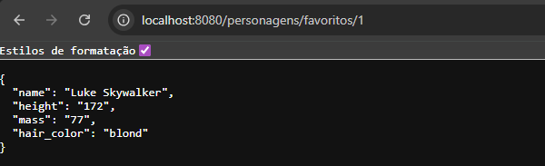

# Consumo de API com Spring Boot

## Objetivo

Este projeto tem como objetivo demonstrar o consumo de uma API externa utilizando o método GET com Spring Boot.

A aplicação consome dados da SWAPI (Star Wars API) e retorna as informações de um personagem em formato JSON.

---

## Tecnologias utilizadas

* Java
* Spring Boot
* RestTemplate
* Maven

---

## Endpoint

```
GET /personagens/favoritos/{id}
```

### Exemplo de requisição



```
http://localhost:8080/personagens/favoritos/1
```

---

## Exemplo de resposta

```json
{
  "name": "Luke Skywalker",
  "height": "172",
  "mass": "77",
  "hairColor": "blond"
}
```

---

## Exemplo real da requisição


---

## Como executar o projeto

### Rodar pela IDE

Executar a classe principal do Spring Boot

### Rodar pelo terminal

```
mvnw.cmd spring-boot:run
```

---

## Descrição técnica

A aplicação funciona como um intermediário (Backend for Frontend), onde:

1. Recebe uma requisição do cliente
2. Consome a API externa (SWAPI)
3. Converte o JSON para um objeto Java (DTO)
4. Retorna a resposta para o cliente

---

## Tratamento de erros

* Caso a API externa falhe: retorna 502 - Bad Gateway
* Caso o personagem não seja encontrado: retorna 404 - Not Found

---

## Autor

Jefferson Silva Geronimo
